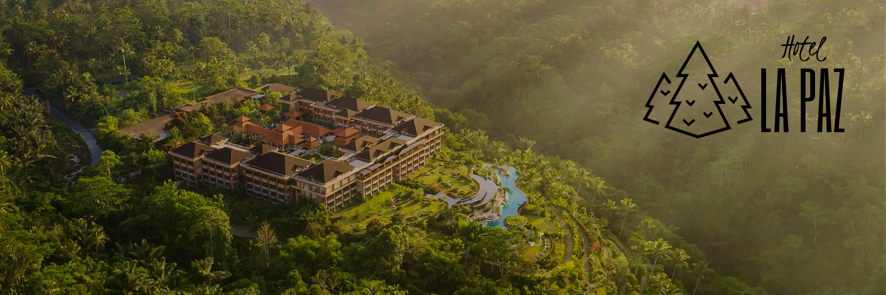
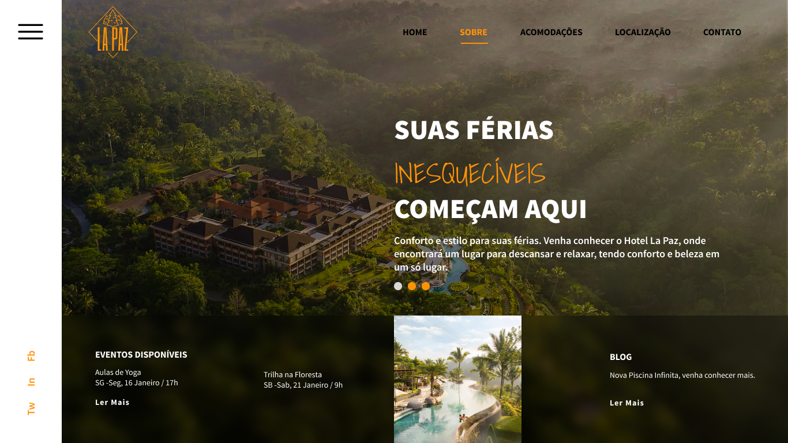

# **PÁGINA SOBRE DE UM HOTEL**
### 📌 Desafio individual proposto pela T.EX no curso FullStack Javascript.
 

## **Objetivo**

    Criar uma versão da página Sobre.

#### ✅ Aplicar Responsividade mínima para mobile retrato;  
#### ✅ Cabeçalho e Rodapé pode ser idênticos ao projeto;  
#### ✅ Use sua criatividade;  
#### ✅ O exercício é individual.
 

## **Tecnologias utilizadas**

   

 

## **Links**

> [Mockup](https://www.figma.com/file/xLe34EnFRXKllIEg1Elpry/mockup_hotel_sobre?node-id=0%3A1&t=E8A087FlcVbLeMjd-1)  
> [Página](https://edlainex.github.io/hotel_pagina-sobre/)

 

## **Autor**

[Edlaine](https://github.com/edlainex)
